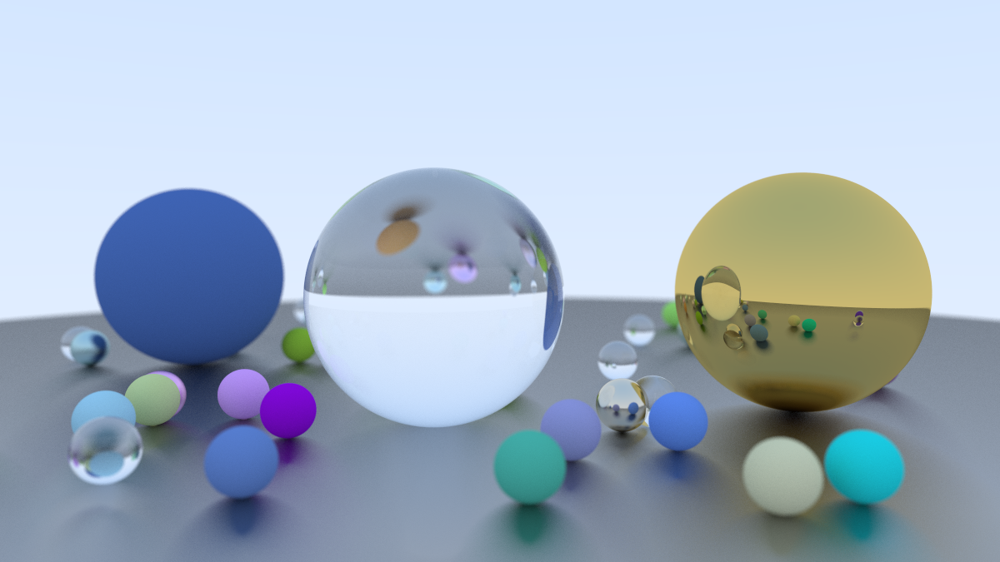

# Ray Tracing in One Weekend + CUDA

With no optimizations other than porting to CUDA, the final image was rendered in about 3 seconds on an RTX 4090.

References:
- [Ray Tracing in One Weekend](https://raytracing.github.io/books/RayTracingInOneWeekend.html)
- [Accelerated Ray Tracing in One Weekend in CUDA](https://developer.nvidia.com/blog/accelerated-ray-tracing-cuda/)
